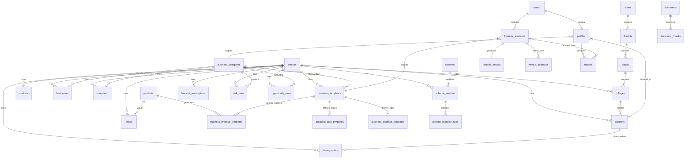

# GramVest Relational Data Architecture & Relationship Map

This document details the relational data model for **GramVest** (SIH 2026 — PS 26091). All application microservices and modules connect to a single authoritative PostgreSQL 15+ database equipped with **PostGIS** and **pgvector**.

---

## 1. High-Level Entity-Relationship (ER) Diagram



---

## 2. Core Relational Navigation Paths

### Path 1: Geographic Hierarchy & Spatial Characterization
```
[states]
   └── (state_id) ──> [districts]
                         └── (district_id) ──> [blocks]
                                                 └── (block_id) ──> [villages]
                                                                        └── (village_id) ──> [locations]
                                                                                                ├── (location_id) ──> [demographics] (Census 2011)
                                                                                                ├── (geometry) ──> PostGIS ST_DWithin (5km / 10km)
                                                                                                └── (location_id) ──> [profiles]
```
- **Spatial Resolution**: Every `village` has centroid coordinates (`latitude`, `longitude`, `geometry`).
- **Radius Analysis**: The GIS engine resolves an entrepreneur's point of interest (`locations.geometry`) against nearby Mandis (`markets.geometry`) and competing units (`businesses.geometry`) using PostGIS spatial indexing (`GIST`).

---

### Path 2: Business Category & Operational Templates
```
[business_categories]
   ├── (business_category_id) ──> [businesses] (Competitor mapping)
   ├── (business_category_id) ──> [equipment] (Setup and machinery costs)
   ├── (business_category_id) ──> [risk_rules] (Deterministic risk factors)
   ├── (business_category_id) ──> [opportunity_rules] (Opportunity scoring logic)
   └── (business_category_id) ──> [business_templates]
                                      ├── (business_template_id) ──> [business_cost_templates]
                                      ├── (business_template_id) ──> [business_revenue_templates] ──> [products] ──> [prices]
                                      └── (business_template_id) ──> [business_expense_templates]
```
- **Deterministic Modeling**: Business templates provide normalized benchmark costs and revenues for Punjab micro-enterprises. These values feed directly into deterministic math formulas without relying on generative AI hallucinations.

---

### Path 3: Government Scheme Routing & Version Governance
```
[schemes]
   └── (scheme_id) ──> [scheme_versions] (Temporal effective dates, caps, subsidies)
                            ├── (scheme_version_id) ──> [scheme_eligibility_rules]
                            └── (source_document_id) ──> [documents] ──> [document_chunks] (pgvector embeddings)
```
- **Zero Hallucination Policy**: Scheme parameters are versioned with strict `effective_from` and `effective_to` dates. Rules use programmatic operators (`<=`, `>=`, `in`) to match entrepreneur profile inputs against scheme criteria.

---

### Path 4: User Journey, Financial Engine & Feasibility Outputs
```
[users]
   └── [profiles]
           ├── Links: location_id, business_category_id, own_capital
           ▼
[financial_scenarios]
   ├── Combines: user_id + business_template_id + project_cost + loan_structure
   ├── Evaluates: Monthly Revenue - Monthly Opex = Operating Profit
   ▼
[financial_results]
   ├── Calculates: EMI, DSCR, Break-Even %, Viability Score
   ▼
[what_if_scenarios]
   ├── Perturbs: selling_price_change_pct, raw_material_change_pct
   ▼
[reports]
   └── Compiles: Bankable Detailed Project Report (DPR) & Feasibility Summary
```

---

## 3. Data Provenance & Source Auditing Traceability
Every data record in the system traces back to an authoritative `sources.id`:
- Census data: `SRC-GOI-CENSUS-2011` (Strictly labeled year 2011).
- Mandi prices: `SRC-PB-MANDI-AGMARK` (Daily AGMARKNET APMC wholesale auction rates).
- Policy guidelines: `SRC-GOI-MSME-PMEGP`, `SRC-GOI-MOFPI-PMFME`, `SRC-GOI-DAHD-AHIDF`.
- Financial benchmarks: `SRC-RBI-BENCHMARK-2026`, `SRC-NABARD-PLP-LDH`.
